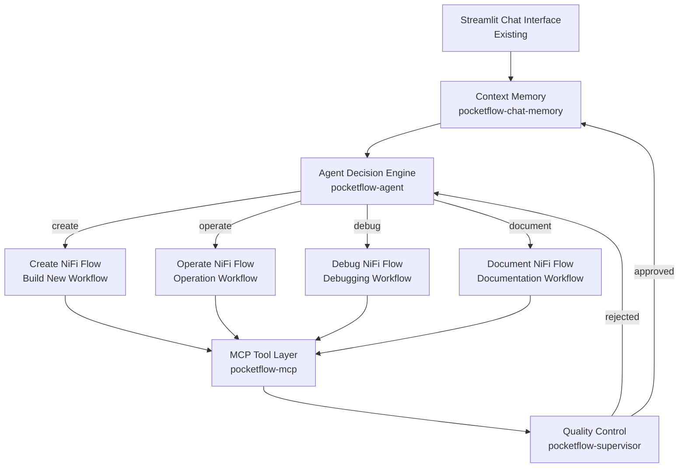

# Guided Workflow Implementation Plan
## PocketFlow Integration for NiFi MCP

### Executive Summary

This document outlines the implementation plan for integrating PocketFlow workflow orchestration into the existing NiFi MCP system. The goal is to provide structured, guided workflows alongside the current unguided approach, enabling better LLM guidance, validation, and user experience while maintaining backwards compatibility.

### Key Benefits Expected
- **Structured LLM guidance**: Replace free-form tool usage with explicit workflow steps
- **Built-in validation**: Add checkpoints and automatic retry mechanisms  
- **Predictable progression**: Users know what happens next instead of hoping the LLM chooses wisely
- **Better progress tracking**: Replace "wait for TASK_COMPLETE" with granular step-by-step progress
- **Phase-driven tool access**: Workflows control which tools are available at each step

---

## PocketFlow Cookbook Template Analysis

### Recommended Implementation Templates

Based on analysis of PocketFlow cookbook examples, the following templates provide the best foundation for our NiFi chatbot workflows:

#### 🎯 **Primary Templates (Essential)**

**1. `pocketflow-mcp` - MCP Integration Foundation**
- **Why Essential**: Direct pattern for MCP tool integration with PocketFlow
- **Key Features**: 
  - Standardized MCP server communication
  - Tool execution through MCP protocol
  - Error handling for MCP tool failures
- **Application**: Core foundation for all NiFi tool interactions
- **Implementation Priority**: Phase 1 (Infrastructure)

**2. `pocketflow-agent` - Decision-Making Engine**
- **Why Critical**: Provides intelligent action selection patterns
- **Key Features**:
  - Context-aware decision making (search/answer → create/operate/debug/document)
  - Action-based conditional routing
  - Loop-back capability for multi-step operations
  - Structured action space definition
- **Application**: Core agent logic for workflow step decisions
- **Implementation Priority**: Phase 1 (Infrastructure)

**3. `pocketflow-supervisor` - Quality Control Layer**
- **Why Valuable**: Ensures reliable NiFi operation execution
- **Key Features**:
  - Output validation before proceeding
  - Retry logic for failed operations
  - Quality assurance checkpoints
  - Rejection and reprocessing loops
- **Application**: Supervising NiFi flow creation/modification for validity

**4. `pocketflow-chat-memory` - Conversational Context**
- **Why Important**: Maintains context across long NiFi operations
- **Key Features**:
  - Sliding window of recent conversations 
  - Vector-based retrieval of relevant past context or lessons learnt
  - Context curation for token efficiency
  - Memory management for extended sessions
- **Application**: Context preservation across workflow sessions


### Enhanced Architecture Integration



---

## Design Decisions

### 1. Execution Modes

The system will support dual execution modes with seamless switching:

- **Unguided Mode**: Current free-form LLM approach with phase-filtered tools
- **Guided Mode**: PocketFlow-orchestrated workflow execution
- **Guided-Unguided Mimic**: PocketFlow wrapper around current behavior (for testing/migration)

### 2. UI Architecture

```
UI Controls:
├── Execution Mode: [Unguided | Guided] 
└── Unguided - Tool Phase Filter: [All | Review | Creation | Modification | Operation]
```

**Key Principles**: 
- **Guided: LLM Workflow Selection**: Default mode where LLM analyzes user objective and selects appropriate workflow  (Planned)
- **Unguided: User Manual Override**: Available to bypass the guided option, and user can interact with LLM directly and choose tools to make available (existing implementation)


### 3. Workflow Definitions

| Workflow | Description | Phases Used | Template Pattern | Output |
|----------|-------------|-------------|------------------|---------|
| Documentation Creation | Generate structured documentation files | Review only | agent + mcp | .md/.html/.pdf files |
| Review & Analysis | Analyze flows, answer questions | Review only | agent + memory | Tailored responses |
| **Debugging** | **Systematic issue resolution** | **Review → Modification → Operation** | **agent + supervisor** | **Fixed NiFi flows** |
| Build New | Create complete new flows | Review → Creation → Modification → Operation | agent + mcp + supervisor | New NiFi flow |
| Build Modify | Modify existing flows | Review → Creation → Modification → Operation | agent + mcp + supervisor | Modified NiFi flow |

**⚠️ Priority Update**: **Debugging Workflow moved to Phase 4 (high priority)** due to observed LLM reliability issues in practice.

### 4. Context Management Strategy

**Initial Approach (Phase 1)**:
- **UI History**: Full conversation for display purposes
- **LLM Context**: Current token-based purging system (works fine initially)
- **Context Curation**: Smart filtering within workflow nodes based on current objective
- **Tool Results**: Nodes extract relevant tool results rather than passing everything

**Enhanced with Lessons Learned (Later Phases)**:
- **Lessons Learned Index**: Vector-based retrieval of relevant insights from past tasks
- **Context Optimization**: LLM-generated lessons after each completed workflow
- **Smart Retrieval**: "Generate docs for flow X" → retrieve similar documentation lessons
- **Knowledge Retention**: Build institutional knowledge for better future task execution

### 5. Interruption Handling (Phase 1)

- **User Stop**: Abandon workflow, return to unguided mode, preserve context in memory
- **User Questions**: Agent pattern handles mid-workflow questions and continues
- **No workflow nesting or complex state management**

### 6. Action Limits (Phase 1)

- **Maintain existing 10-action limit per workflow step**
- **Each workflow step can use multiple tools within the limit**
- **Action limit reached**: Pause, show status, wait for user to continue or stop**

### 7. Error Handling 

**Enhanced Error Categorization (Later Phases)**:

```python
error_categories = {
    "tool_usage": {
        "description": "Wrong parameters, malformed requests",
        "retry_strategy": "fix_parameters_and_retry",
        "max_retries": 2,
        "escalation": False
    },
    "nifi_validation": {
        "description": "Invalid processor states, missing connections", 
        "retry_strategy": "analyze_and_fix_state",
        "max_retries": 3,
        "escalation": False
    },
    "syntax_errors": {
        "description": "EL expressions, script syntax issues",
        "retry_strategy": "expert_analysis_required", 
        "max_retries": 1,
        "escalation": True  # May need specialized help
    },
    "relationship_errors": {
        "description": "Unterminated relationships, flow structure",
        "retry_strategy": "auto_fix_relationships",
        "max_retries": 2, 
        "escalation": False  # Usually easy to fix
    },
    "system_errors": {
        "description": "NiFi server issues, genuine bugs",
        "retry_strategy": "escalate_immediately",
        "max_retries": 0,
        "escalation": True
    }
}
```

**Error-Specific Node Routing**:
- **Tool Usage Errors**: Fix parameters and retry automatically
- **NiFi Validation Warnings**: Analyze state and apply targeted fixes
- **Syntax Errors**: May require expert analysis for EL/script issues
- **Relationship Errors**: Auto-fix unterminated relationships
- **System Errors**: Immediate escalation to human support

---

## Code Consistency and Integration Patterns

### Following Existing Codebase Patterns

**Critical Principle**: All new workflow code must follow existing patterns and conventions in the NiFi MCP codebase to ensure consistency, maintainability, and seamless integration.

#### Logging Patterns
Follow existing logging setup and patterns:
```python
# Follow existing logging setup from config/logging_setup.py
from config.logging_setup import setup_logging, request_context
from loguru import logger

# Use existing bound logger pattern
bound_logger = logger.bind(
    user_request_id=user_request_id, 
    action_id=action_id,
    workflow_id=workflow_id  # New workflow-specific binding
)
bound_logger.info("Workflow step started", step_name=step_name)

# Follow existing context variable patterns
from .request_context import current_nifi_client, current_request_logger
```

#### Configuration Patterns
Extend existing configuration system:
```python
# Follow config/settings.py patterns
# Add workflow config to existing config.yaml structure
workflows:
  execution_mode: "unguided"  # unguided | guided
  default_action_limit: 10
  retry_attempts: 3
  enabled_workflows:
    - "documentation"
    - "review_analysis" 
    - "build_new"
    - "build_modify"

# Use existing get_* functions pattern in settings.py
def get_workflow_config():
    return config.get('workflows', {})
```

#### Chat UI Integration Patterns
Follow existing Streamlit patterns and state management:
```python
# Follow existing session state patterns in nifi_chat_ui/app.py
if "workflow_state" not in st.session_state:
    st.session_state.workflow_state = None

# Follow existing component organization in nifi_chat_ui/components/
# Use existing styling and layout patterns
# Maintain consistency with existing progress display patterns

# Follow existing conversation history management
# Extend existing message handling without breaking current patterns
```

#### API Patterns
Follow existing FastAPI endpoint patterns:
```python
# Follow server.py patterns for new workflow endpoints
@app.post("/workflows/{workflow_name}/execute", tags=["Workflows"])
async def execute_workflow(
    workflow_name: str,
    payload: WorkflowExecutionPayload,
    request: Request,
    nifi_server_id: Optional[str] = Header(None, alias="X-Nifi-Server-Id")
):
    # Follow existing context setup patterns
    user_request_id = request.state.user_request_id
    action_id = request.state.action_id
    bound_logger = logger.bind(user_request_id=user_request_id, action_id=action_id)
    
    # Follow existing error handling patterns
    try:
        # Workflow execution logic
        pass
    except Exception as e:
        bound_logger.error(f"Workflow execution error: {e}", exc_info=True)
        raise HTTPException(status_code=500, detail="Workflow execution failed")
```

#### Tool Integration Patterns
Reuse existing MCP tool calling patterns:
```python
# Follow existing tool calling patterns from api_tools/
# Use existing tool registration and phase filtering
# Maintain existing tool response formatting
# Follow existing error handling for tool failures

# Extend existing _tool_phase_registry pattern for workflow-aware tools
_workflow_phase_registry = {
    "documentation": {
        "discover_components": ["review"],
        "analyze_structure": ["review"],
        "generate_docs": ["review"]
    }
}
```

#### Error Handling Patterns
Follow existing error handling and exception patterns:
```python
# Use existing McpError and ToolError patterns
from mcp.shared.exceptions import McpError
from mcp.server.fastmcp.exceptions import ToolError

# Follow existing error logging and user messaging patterns
# Maintain consistency with existing error recovery mechanisms
```

#### Testing Patterns
Follow existing test organization and patterns:
```python
# Follow existing test patterns in tests/
# Use existing fixtures and test utilities
# Maintain existing test naming conventions
# Follow existing mocking patterns for NiFi client interactions
```

### Integration Checkpoints

For each implementation phase, verify:
1. **Logging consistency**: All new logs follow existing format and context patterns
2. **Configuration integration**: New config extends existing structure without conflicts  
3. **UI consistency**: New components match existing styling and interaction patterns
4. **API consistency**: New endpoints follow existing request/response patterns
5. **Error handling**: New error paths use existing exception types and handling
6. **Testing consistency**: New tests follow existing organization and patterns

---

## Technical Architecture

### Core Components

```python
# Main orchestration
class GuidedWorkflowExecutor:
    - execute_workflow()
    - handle_user_interruption() 
    - manage_action_limits()

# Individual workflow steps  
class WorkflowNode(Node):  # Inherits from PocketFlow Node
    - prep() - Get context for step
    - exec() - Execute with multiple tools/actions
    - post() - Update shared state, determine next step

# Context and state management
class ContextManager:
    - curate_context_for_next_step()
    - filter_relevant_messages()

class WorkflowState:
    - current_workflow
    - shared_data
    - progress_tracking

# Enhanced LLM calling
def call_llm_with_tools_and_limit():
    # Allow multiple tool calls within action limit
    # Handle user questions mid-step
    # Return structured results
```

### Multi-Level Progress Tracking

```
Objective (Session Level)
├── User Request (Chat Level - Req Id)
│   ├── Workflow: Build New (Workflow Level)
│   │   ├── Step: Analyze Requirements (Step Level)
│   │   │   ├── Action: list_processors (Action Level - Act Id)
│   │   │   └── Action: document_flow (Action Level - Act Id)
│   │   └── Step: Create Processors (Step Level)
│   └── LLM Response (Chat Level)
```

**Logging Strategy**:
- **Chat UI Log**: User requests and LLM responses (existing)
- **Workflow Log**: New dedicated log for workflow internals - Introduce Workflow Id (name), Step Id (name).  Display Req Id in logs
- **Backend Logs**: Existing LLM, MCP, client, server logs (unchanged), pick up Workflow and Step Id's to show in logs

---

## File Structure

```
nifi_mcp_server/
├── workflows/                          # New workflow system
│   ├── __init__.py
│   ├── core/                          # Core workflow infrastructure  
│   │   ├── __init__.py
│   │   ├── executor.py                # GuidedWorkflowExecutor
│   │   ├── context_manager.py         # Context curation logic
│   │   ├── progress_tracker.py        # Multi-level progress tracking
│   │   ├── error_handler.py           # Error handling and retries
│   │   └── llm_integration.py         # Enhanced LLM calling with action limits
│   ├── nodes/                         # Base node classes
│   │   ├── __init__.py
│   │   ├── base_node.py               # Base WorkflowNode class
│   │   └── nifi_node.py               # NiFi-specific node base class
│   ├── definitions/                   # Individual workflow definitions
│   │   ├── __init__.py
│   │   ├── documentation.py           # Documentation workflow
│   │   ├── review_analysis.py         # Review & Analysis workflow  
│   │   ├── build_new.py               # Build New workflow
│   │   ├── build_modify.py            # Build Modify workflow
│   │   └── unguided_mimic.py          # Guided-unguided mimic workflow
│   ├── registry.py                    # Workflow registration and discovery
│   └── config.py                      # Workflow configuration
├── server.py                          # Updated to include workflow routes
└── (existing files unchanged)

nifi_chat_ui/
├── components/
│   ├── WorkflowSelector.py            # New workflow selection component
│   └── ProgressTracker.py             # Enhanced progress display
├── app.py                             # Updated UI with workflow controls
└── (existing files unchanged)

config/
├── workflows.yaml                      # Workflow configuration
└── (existing files unchanged)

tests/
├── workflows/                         # Workflow-specific tests
│   ├── test_executor.py
│   ├── test_context_manager.py  
│   ├── test_workflows/
│   │   ├── test_documentation.py
│   │   ├── test_build_new.py
│   │   └── test_unguided_mimic.py
│   └── integration/
│       └── test_workflow_integration.py
└── (existing test files unchanged)

docs/
├── workflows/                         # Workflow documentation
│   ├── workflow_development_guide.md
│   ├── node_development_guide.md
│   └── troubleshooting.md
└── (existing docs unchanged)
```

---

## Implementation Plan

### Phase 1: Foundation - Unguided Mimic

**Goal**: Establish solid foundational infrastructure with working PocketFlow integration

**Why This Approach**: Build common capabilities that all specialized workflows will need, making future workflows trivial to implement by focusing only on their unique aspects.

**Core Components**:
1. **UnguidedMimicWorkflow** - Single workflow that replicates current unguided behavior
   - `InitializeNode` - Set up objective, available tools, context, tracking IDs
   - `LLMIterationNode` - Execute current prompts, handle tool calls, maintain state
   - `EvaluateCompletionNode` - Assess completion, determine next action, handle status

2. **Integration Infrastructure**
   - **Streamlit Real-time Feedback**: Display tool calls as they happen (like current system)
   - **Logging Integration**: requestId, actionId, workflowId, stepId tracking through all systems
   - **MCP Integration**: Proven tool calling through PocketFlow nodes
   - **Configuration Integration**: Workflow settings through existing config system

3. **Progress Tracking & UI**
   - Real-time workflow step and llm mcp tool calls (and tokens) updates to Streamlit
   - Integration with existing chat interface
   - Proper error handling and user feedback

**Detailed Tasks**:

**Step 1: Core Workflow Foundation**
1. **Implement UnguidedMimicWorkflow nodes**:
   ```python
   class InitializeNode(Node):
       """Set up workflow context and tracking."""
       def prep(self, shared):
           return {
               "user_objective": shared["user_request"],
               "workflow_id": generate_workflow_id(),
               "available_tools": get_available_tools_for_phase(shared["current_phase"]),
               "context": shared.get("conversation_history", [])
           }
       
       def exec(self, prep_res):
           # Initialize workflow state
           return prep_res
       
       def post(self, shared, prep_res, exec_res):
           shared["workflow_initialized"] = True
           shared["workflow_id"] = exec_res["workflow_id"]
           return "continue"
   
   class LLMIterationNode(Node):
       """Execute LLM iterations with tool calls (current logic)."""
       def exec(self, prep_res):
           # Use existing LLM calling logic with current prompts
           # Handle tool calls through MCP
           # Provide real-time feedback to Streamlit
           pass
       
       def post(self, shared, prep_res, exec_res):
           if exec_res["llm_says_complete"]:
               return "evaluate"
           elif exec_res["action_limit_reached"]:
               return "evaluate"
           else:
               return "continue"  # Loop back to self
   
   class EvaluateCompletionNode(Node):
       """Assess what happened and determine next steps."""
       def exec(self, prep_res):
           # Determine why LLM stopped
           # Decide what to show user
           # Handle different completion scenarios
           pass
   ```

2. **Real-time Streamlit Integration**:
   - Implement workflow step progress in existing chat UI
   - Show tool calls as they happen (maintain current UX)
   - Display workflow status and step information

3. **Logging Infrastructure**:
   - Extend existing logging with workflowId tracking
   - Ensure logs can trace: requestId → workflowId → nodeId → actionId
   - Integration with existing bound logger patterns

**Step 2: Integration Testing**
1. **End-to-end Integration**:
   - UnguidedMimicWorkflow produces identical results to current unguided mode
   - All existing functionality preserved (no regressions)
   - Real-time feedback working in Streamlit

2. **Infrastructure Validation**:
   - MCP tool calls work through PocketFlow nodes
   - Logging traces complete workflow execution
   - Configuration integration functional
   - Error handling preserves existing patterns

**Step 3: Polish & Validation**
1. **Performance & Reliability**:
   - Workflow execution performance comparable to current system
   - Error handling covers all current scenarios
   - User experience matches or improves current system

2. **Documentation & Testing**:
   - Complete integration patterns documented
   - Test suite covers all integration points
   - Ready for Phase 2 common patterns

**Success Criteria**:
- ✅ UnguidedMimicWorkflow produces identical results to current unguided mode
- ✅ Real-time tool call feedback working in Streamlit UI
- ✅ Complete logging traceability (requestId → workflowId → nodeId → actionId)
- ✅ All existing functionality preserved with zero regressions
- ✅ MCP integration proven through PocketFlow workflow
- ✅ Foundation ready for common pattern implementation

### Phase 2: Common Patterns Foundation

**Goal**: Build shared capabilities that all specialized workflows will use

**Why This Approach**: Implement the common patterns (decision-making, quality control, error handling) that every workflow needs. This makes Phase 3+ specialized workflows trivial since they just combine these proven building blocks.

**Core Components**:
1. **Workflow Decision Engine** - Used by all workflows to determine sub-flows
2. **Quality Control System** - Supervisor pattern for validation and retries  
3. **Error Handling Framework** - Categorized error recovery for all workflows
4. **Shared Node Library** - Common nodes all workflows will reuse

**Detailed Tasks**:

**Step 1: Workflow Decision Engine**
1. **Implement WorkflowDecisionNode** (agent pattern):
   ```python
   class WorkflowDecisionNode(Node):
       """Decide which specialized workflow to follow based on user objective."""
       def exec(self, prep_res):
           user_objective = prep_res["user_objective"]
           
           # Structured decision making
           decision_prompt = f"""
           User objective: {user_objective}
           
           Available workflows:
           - document: Generate documentation, explain flows
           - debug: Fix issues, resolve errors, troubleshoot
           - create: Build new flows from scratch  
           - modify: Change existing flows
           - analyze: Answer questions, provide analysis
           
           Which workflow should handle this objective?
           Return: workflow_name, confidence_score, reasoning
           """
           
           decision = call_llm_with_structured_output(decision_prompt)
           return decision
       
       def post(self, shared, prep_res, exec_res):
           shared["selected_workflow"] = exec_res["workflow_name"]
           shared["decision_confidence"] = exec_res["confidence_score"]
           return exec_res["workflow_name"]  # Routes to specific workflow
   ```

2. **Implement workflow routing infrastructure**:
   - Dynamic workflow loading based on decision
   - Workflow registration system
   - Fallback to UnguidedMimic if decision unclear

**Step 2: Quality Control System**
1. **Implement Supervisor Pattern nodes**:
   ```python
   class OutputValidationNode(Node):
       """Validate outputs before proceeding to next step."""
       def exec(self, prep_res):
           output_to_validate = prep_res["output"]
           validation_criteria = prep_res["criteria"]
           
           # Quality assessment
           validation_result = self.assess_quality(output_to_validate, validation_criteria)
           return validation_result
       
       def post(self, shared, prep_res, exec_res):
           if exec_res["approved"]:
               return "continue"
           elif exec_res["retry_count"] < 3:
               shared["retry_count"] = exec_res["retry_count"] + 1
               return "retry"
           else:
               return "escalate"
   
   class CompletionSupervisorNode(Node):  
       """Assess if LLM really completed the objective."""
       def exec(self, prep_res):
           user_objective = prep_res["user_objective"]
           llm_final_response = prep_res["llm_response"]
           workflow_results = prep_res["workflow_results"]
           
           # Supervisor assessment
           assessment_prompt = f"""
           Original objective: {user_objective}
           LLM says: {llm_final_response}
           Results produced: {workflow_results}
           
           Did the objective get completed? Rate 1-10 and explain.
           """
           
           assessment = call_llm_with_structured_output(assessment_prompt)
           return assessment
   ```

2. **Integrate quality gates into common flow patterns**:
   - Standard validation checkpoints
   - Automated retry logic
   - Escalation handling

**Step 3: Error Handling Framework**  
1. **Implement enhanced error categorization**:
   ```python
   class ErrorCategorizationNode(Node):
       """Categorize errors for targeted recovery strategies."""
       def exec(self, prep_res):
           error_info = prep_res["error"]
           
           # Categorize error
           category = self.categorize_error(error_info)
           recovery_strategy = self.get_recovery_strategy(category)
           
           return {
               "category": category,
               "strategy": recovery_strategy,
               "max_retries": recovery_strategy["max_retries"],
               "escalation_needed": recovery_strategy["escalation"]
           }
   ```

2. **Error-specific recovery nodes**:
   - ParameterFixNode for tool usage errors
   - StateAnalysisNode for NiFi validation errors  
   - ExpertAnalysisNode for syntax errors
   - AutoFixNode for relationship errors

**Success Criteria**:
- ✅ WorkflowDecisionNode accurately routes 90%+ of objectives to correct workflows
- ✅ Supervisor pattern catches and fixes common quality issues automatically
- ✅ Error categorization enables targeted recovery with improved success rates
- ✅ Common node library ready for use by all specialized workflows
- ✅ Quality gates prevent low-quality outputs from proceeding

### Phase 3: Specialized Workflows Implementation

**Goal**: Implement specialized workflows using proven common patterns

**Why Now Trivial**: With decision engine, quality control, error handling, and common nodes established, each specialized workflow just focuses on its unique logic while reusing proven building blocks.

**Step 1: Document & Analyze Workflows**
- **DocumentationWorkflow**: Uses common decision → validation → completion supervisor
- **AnalysisWorkflow**: Reuses error handling and quality control patterns
- **Focus**: Unique logic for document generation and analysis, everything else is reused

**Step 2: Debug & Create Workflows**  
- **DebuggingWorkflow**: Uses error categorization and systematic recovery patterns
- **CreateWorkflow**: Uses quality gates and validation checkpoints
- **Focus**: Unique NiFi-specific logic, all infrastructure already proven

**Step 3: Modify Workflow**
- **ModifyWorkflow**: Combines all proven patterns for complex modification logic
- **Focus**: Modification-specific safety checks, everything else reused

**Implementation Pattern for Each Workflow**:
```python
def create_specialized_workflow(workflow_type):
    # All workflows start the same way
    decision_node = WorkflowDecisionNode()  # Common
    initialize_node = InitializeNode()       # Common
    
    # Workflow-specific nodes (only focus on unique logic)
    if workflow_type == "document":
        unique_nodes = [DiscoverComponentsNode(), GenerateDocsNode()]
    elif workflow_type == "debug":  
        unique_nodes = [AnalyzeErrorsNode(), ImplementFixNode()]
    # etc.
    
    # All workflows end the same way
    supervisor_node = CompletionSupervisorNode()  # Common
    
    # Wire together with common error handling
    return build_workflow_with_common_patterns(unique_nodes)
```

**Success Criteria**: 
- ✅ Each specialized workflow implemented in ~1 week (vs. months without common patterns)
- ✅ All workflows share quality control, error handling, decision-making
- ✅ Focus time spent on unique workflow logic, not infrastructure
- ✅ Consistent user experience across all workflow types

### Phase 4: Optimization & Lessons Learned

**Goal**: Optimize performance and implement lessons learned system

**Enhanced Tasks**:
1. **Performance optimization** of common patterns
2. **Lessons learned system** using chat-memory patterns for institutional knowledge
3. **Advanced context management** with vector retrieval for similar past tasks

**Success Criteria**:
- ✅ All workflows perform efficiently with optimized common patterns
- ✅ Lessons learned system improves future task execution
- ✅ System builds institutional knowledge over time

---


## PocketFlow Integration Learnings

### Template Pattern Validation

Our Phase 1 implementation validated that the recommended cookbook patterns are directly applicable:

#### 1. **MCP Integration Pattern**
- `pocketflow-mcp` patterns work directly with our existing MCP tool infrastructure
- Tool calling patterns require no modification to existing MCP tools
- Error handling patterns align with existing MCP error handling

#### 2. **Agent Decision Pattern**
- `pocketflow-agent` conditional routing patterns validated with PocketFlow
- Successor dictionary approach confirmed working for complex routing
- Action space definition patterns applicable to NiFi tool selection

#### 3. **Memory Pattern** 
- `pocketflow-chat-memory` sliding window approach aligns with our context curation needs
- Vector similarity patterns applicable to NiFi workflow context retrieval
- Memory management patterns solve our long conversation context issues

#### 4. **Supervisor Pattern**
- `pocketflow-supervisor` retry and validation patterns directly applicable
- Quality assessment patterns align with NiFi flow validation needs
- Rejection and reprocessing loops solve our reliability concerns

### Combined Pattern Architecture

The cookbook analysis confirms our architectural approach while providing specific implementation guidance:

```python
# Combined pattern implementation example
class NiFiWorkflowNode(Node):
    """Base node combining all cookbook patterns."""
    
    def __init__(self, name: str, workflow_type: str):
        super().__init__()
        self.name = name
        self.workflow_type = workflow_type
        self.context_manager = ContextManager()  # Memory pattern
        self.supervisor = SupervisorValidator()   # Supervisor pattern
        self.agent_logic = AgentDecision()       # Agent pattern
        self.mcp_tools = MCPToolCaller()         # MCP pattern
    
    def prep(self, shared: Dict[str, Any]) -> Dict[str, Any]:
        """Prepare context using memory pattern."""
        return self.context_manager.curate_context_for_step(
            self.name, shared=shared, workflow_type=self.workflow_type
        )
    
    def exec(self, prep_res: Dict[str, Any]) -> Dict[str, Any]:
        """Execute using agent + MCP patterns."""
        # Agent pattern for decision making
        decision = self.agent_logic.make_decision(prep_res)
        
        # MCP pattern for tool execution
        result = self.mcp_tools.execute_tools(decision["tools"], decision["params"])
        
        return {
            "decision": decision,
            "tool_results": result,
            "status": "success" if result else "error"
        }
    
    def post(self, shared, prep_res, exec_res):
        """Post-process using supervisor pattern."""
        # Supervisor pattern for quality validation
        validation = self.supervisor.validate_result(exec_res)
        
        if validation["approved"]:
            # Memory pattern for context storage
            self.context_manager.store_step_result(self.name, exec_res)
            shared[f"{self.name}_result"] = exec_res
            return "success"
        else:
            return "retry" if validation["retry_count"] < 3 else "failed"
```

This integrated approach provides:
- ✅ **Proven patterns** from PocketFlow cookbook
- ✅ **Systematic decision making** through agent patterns
- ✅ **Quality assurance** through supervisor patterns
- ✅ **Context continuity** through memory patterns
- ✅ **Tool integration** through MCP patterns
- ✅ **Direct implementation guidance** from working examples

---

## Conclusion

The integration of PocketFlow cookbook patterns into our existing implementation plan significantly strengthens our approach. The recommended templates provide proven architectural patterns that directly address our specific needs:

**Primary Patterns**:
- **`pocketflow-mcp`**: Solid foundation for NiFi tool integration
- **`pocketflow-agent`**: Intelligent workflow routing and decision making  
- **`pocketflow-supervisor`**: Quality assurance and early reliability
- **`pocketflow-chat-memory`**: Lessons learned system for long-term optimization

**Key Implementation Insights**:
- **LLM Workflow Selection**: Default to automatic workflow selection based on user objectives
- **Quality Control Early**: Supervisor pattern implemented in Phase 3 for immediate reliability
- **Enhanced Error Handling**: Categorized error types with specific recovery strategies  
- **Lessons Learned Focus**: Vector retrieval optimized for institutional knowledge building
- **Context Management**: Smart filtering in nodes rather than complex memory systems initially

By combining these patterns with our existing technical foundation, we can build a robust, reliable, and user-friendly guided workflow system that provides measurable improvements over the current unguided approach while maintaining full backwards compatibility.
